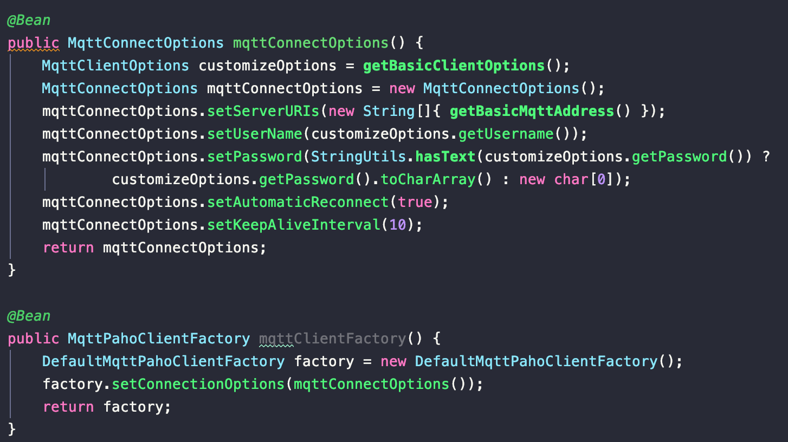
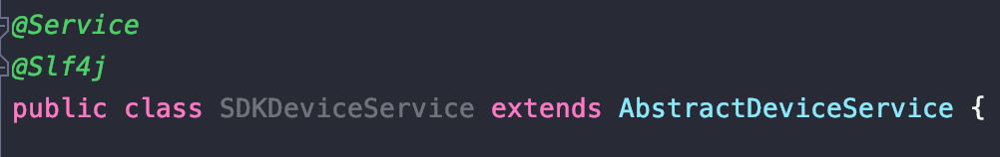
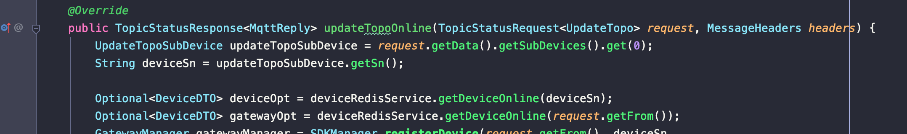
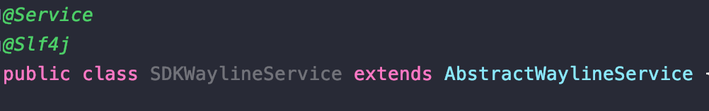
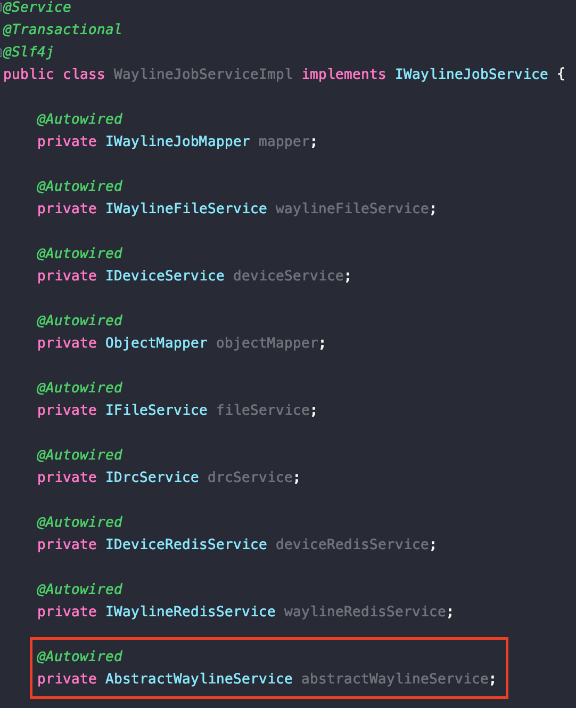
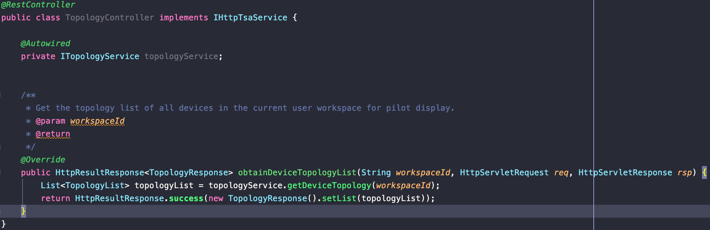

# How to Integrate CloudSDK

### 1. Add package name in component scan: com.dji.sdk

### [2. Connect MQTT](#how-to-connect-mqtt)

### [3. Implement SDK methods](#how-to-implement-sdk-methods)

### [4. Call SDK methods](#how-to-call-sdk-methods)

## How to Connect MQTT

- Inject MqttConnectOptions and MqttPahoClientFactory in the Spring container;
  

- Configure cloud-sdk.mqtt.inbound-topic in application.yml. If not configured, initialization subscription will not be performed.

## How to Implement SDK Methods

- Define a class that inherits from the abstract class in the com.dji.sdk.cloudapi.\*.api package;
- Override specific methods to implement functionality;
- Put the defined class into the Spring container to be managed by Spring's bean lifecycle.

### 【Device Online】Example:

- Define a class: SDKDeviceService inherits AbstractDeviceService;
  
- Override the updateTopoOnline method to implement device online functionality.
  

## How to Call SDK Methods

- Define a class that inherits from the abstract class in the com.dji.sdk.cloudapi.\*.api package;
- Inject this class in the class that needs to call it;
- Call the specific methods.

### 【Waypoint Pre-delivery Command】Example:

- Define a class: SDKWaylineService inherits AbstractWaylineService;
  
- Inject this class in WaylineJobServiceImpl;
  
- Call the delivery command method:
  

## How to Implement CloudAPI Defined HTTP Interfaces

- Define a class that implements the HTTP interface class in the com.dji.sdk.cloudapi.\*.api package;
- Override specific methods to implement the interface, no need to define request address, method and other data.
  

## How to View All HTTP Interfaces Defined by CloudAPI

- Start the program
- Open browser: http://localhost:6789/swagger-ui/index.html

## How to Integrate WebSocket

- CloudSDK has already defined WebSocket service, but has not implemented WebSocket management. Default address is: http://localhost:6789/api/v1/ws
- Custom integration reference: com.dji.sample.component.websocket.config
